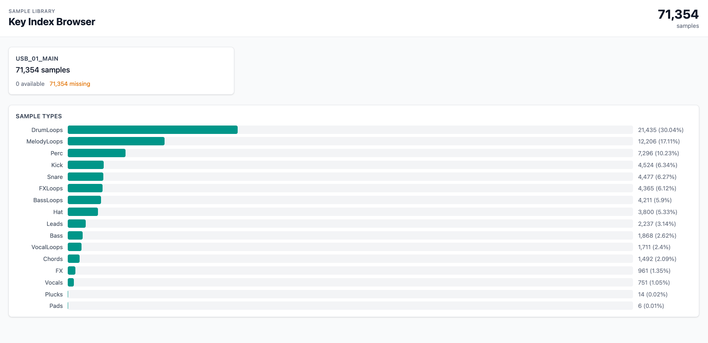
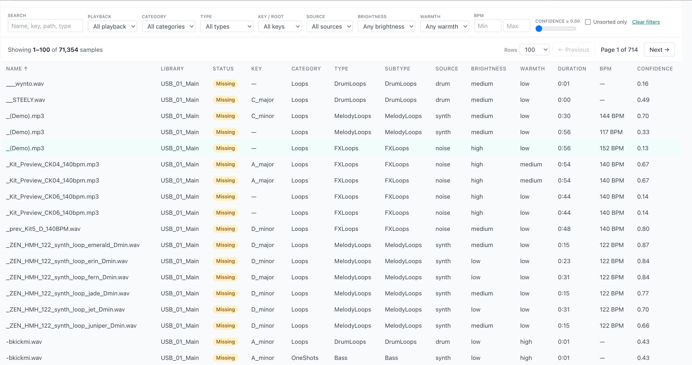
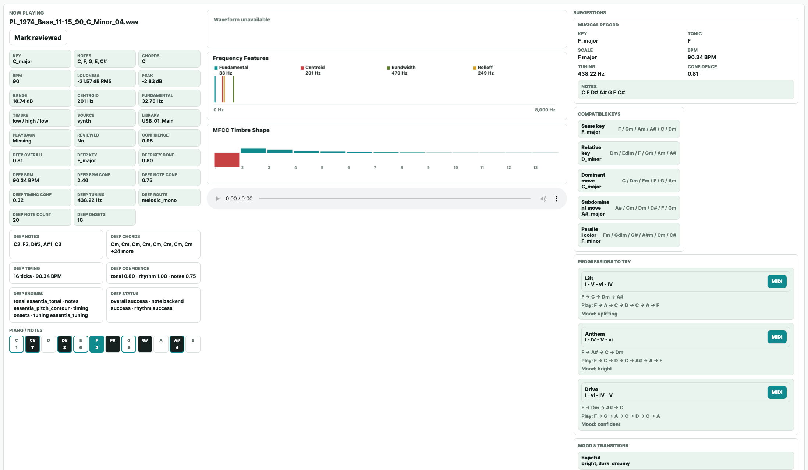

# Sample Library Key Indexer

You have thousands of audio samples — kicks, snares, bass hits, melody loops, pads, vocal chops — scattered across USB sticks, hard drives, and download folders. You're working on a track in A minor and need a bass loop that fits. Good luck finding one: your samples are buried in folders named things like `Pack_Vol3_Final_v2`, and you have no idea what key any of them are in.

**Sample Key Indexer** fixes this. Point it at any folder of samples and it will automatically:

- **Detect the musical key and root note** of every sample using multiple audio engines (librosa, essentia, KeyFinder, basic-pitch) cross-checked against each other
- **Classify each sample by type** — Kick, Snare, Hi-Hat, Bass, Lead, Pad, Chord, Melody Loop, Drum Loop, Vocal, FX, and 15+ categories — using filename patterns and audio feature analysis
- **Organize everything into clean folders by key and type** — all your A-minor bass loops in one place, all your E-major melody loops in another, drums sorted by kick/snare/hat
- **Build a rich metadata index** with root note, key, BPM, confidence scores, timbre, loudness, frequency features, and deep analysis for every single sample
- **Serve a web UI** for browsing, filtering, previewing, and reviewing your entire library from a browser — across multiple libraries and external drives

### See it in action

**Dashboard** — library overview with sample type breakdown and distribution charts:



**Browse** — search, filter by key/type/BPM/confidence, sort by any column, and preview audio inline:



**Sample Detail** — full analysis for any sample: detected key, notes, chords, frequency spectrum, MFCC timbre shape, compatible keys, chord progressions to try, and downloadable MIDI:



### Why use this?

- **Works at scale** — tested on 71,000+ samples across multiple libraries
- **Resumable** — crashes, USB disconnects, or running out of time? Pick up exactly where you left off
- **Catalog without copying** — index samples on a USB stick or external drive without duplicating any audio
- **Multi-library** — load indexes from multiple drives and browse them all in one UI
- **Deep analysis** — beyond just key detection: BPM, tuning (Hz), note transcription, onset detection, chord estimation, and confidence scoring across multiple engines
- **Fully local** — no cloud, no accounts, no subscriptions. Your samples and metadata stay on your machine

---

## Table of Contents

- [Install](#install)
- [Quick Start](#quick-start)
- [Commands](#commands)
  - [sample-key-indexer](#sample-key-indexer--core-indexer)
  - [sample-key-indexer-kitchen-sink](#sample-key-indexer-kitchen-sink--all-in-one)
  - [sample-key-indexer-review](#sample-key-indexer-review--enrichment--verification)
  - [sample-key-indexer-web](#sample-key-indexer-web--web-browser-ui)
  - [sample-key-indexer-sanitize](#sample-key-indexer-sanitize--library-cleanup)
- [Output Structure](#output-structure)
- [Analysis Engines](#analysis-engines)
- [Web UI Guide](#web-ui-guide)
- [Workflows](#workflows)
- [Developing the Frontend](#developing-the-frontend)
- [Troubleshooting](#troubleshooting)
- [Version History](#version-history)

---

## Install

```bash
cd /path/to/sample-key-indexer
python3 -m venv .venv
source .venv/bin/activate
pip install -e .
```

### External Dependencies

These are not installable via pip and must be set up separately:

| Tool | Required? | Purpose |
|------|-----------|---------|
| **KeyFinder CLI** | Required | External key detection backend. Install and ensure `keyfinder-cli` or `keyfinder` is on `PATH`. |
| **ffprobe** / **ffmpeg** | Recommended | Fast duration probing, AIFF→WAV transcoding in web UI, conversion retry for KeyFinder failures. |
| **sonic-annotator** | Optional | Deep harmonic analysis (V4 deep-analysis routes). |
| **aubio** | Optional | Onset/tempo detection for deep analysis. |

Verify your setup:

```bash
sample-key-indexer /any/path /any/output --doctor
```

---

## Quick Start

### Path Placeholders

Throughout this guide, replace these placeholders with your actual folder paths:

| Placeholder | Meaning | Example |
|-------------|---------|---------|
| `/path/to/Samples` | The folder containing your source audio samples to be organized | `~/Music/MySamples`, `/Volumes/USB_01/Samples` |
| `/path/to/Output` or `/path/to/Organised` | Where samples are copied/moved to, organized into folders by musical key and sample type (e.g., `Key/A_minor/OneShots/Bass/`). See [Output Structure](#output-structure) | `~/Desktop/Samples_Organised` |
| `/path/to/Indexes/MY_LIBRARY` | Same as Output, but used with `--catalog-only` to store only the metadata index (no audio is copied). Useful for cataloging USB sticks or external drives — the web UI can then browse the index and stream audio from the original source via `--library-root` | `~/SampleIndexes/usb_01` |

### Commands

All commands below (e.g., `sample-key-indexer`, `sample-key-indexer-web`, `sample-key-indexer-kitchen-sink`) are CLI tools installed by `pip install -e .`. They are available in your terminal after activating the venv. Each one is a different tool for a different stage of the workflow — see the [Commands](#commands) section for full details.

### 1. Check your environment

```bash
sample-key-indexer ~/Music/MySamples ~/Desktop/Samples_Organised --doctor
```

### 2. Dry run (analyze without copying files)

```bash
sample-key-indexer ~/Music/MySamples ~/Desktop/Samples_Organised --dry-run
```

### 3. Organize your library

```bash
sample-key-indexer ~/Music/MySamples ~/Desktop/Samples_Organised
```

### 4. Browse in the web UI

```bash
sample-key-indexer-web ~/Desktop/Samples_Organised/metadata_index.sqlite
# Open http://127.0.0.1:8765 in your browser
```

### 5. Full pipeline in one command

```bash
sample-key-indexer-kitchen-sink ~/Music/MySamples ~/SampleIndexes/my_library \
  --keyfinder-convert-retry --keyfinder-workers 8 \
  --deep-analysis smart --deep-analysis-scope musical
```

---

## Commands

### `sample-key-indexer` — Core Indexer

The main command. Scans audio files, analyzes them, classifies them, and optionally copies/moves them into an organized folder structure.

```bash
sample-key-indexer INPUT_ROOT OUTPUT_ROOT [options]
```

**Common flags:**

| Flag | Default | Description |
|------|---------|-------------|
| `--dry-run` | — | Analyze and update metadata without copying/moving files |
| `--catalog-only` | — | Write metadata index without organizing into Key/Unsorted folders |
| `--move` | — | Move files instead of copying |
| `--force` | — | Reprocess files already in the index |
| `--workers N` | auto (1–4) | Number of parallel analysis workers |
| `--engines LIST` | balanced | Comma-separated engines: `librosa`, `essentia` |
| `--analysis-profile PROFILE` | balanced | Preset: `fast`, `balanced`, or `deep` |
| `--max-duration SECS` | 60 | Skip files longer than this (full songs) |
| `--include-long-files` | — | Don't skip long files |
| `--include-ignored-files` | — | Include fullmix/musicloop files normally skipped |
| `--library-id ID` | folder name | Stable ID for the source library |
| `--library-name NAME` | library ID | Human-readable display name |
| `--no-sqlite` | — | Use legacy JSON-only index |
| `--probe-backend MODE` | auto | Duration probe: `auto`, `ffprobe`, or `python` |
| `--doctor` | — | Check audio stack and exit |
| `--report-json PATH` | auto | Custom path for the JSON run report |

**Examples:**

```bash
# Catalog a USB stick without copying files
sample-key-indexer /Volumes/USB_01/Samples /path/to/Indexes/usb_01 \
  --catalog-only --library-id usb_01 --library-name "USB 01"

# Fast analysis with librosa only
sample-key-indexer /path/to/Samples /path/to/Output --analysis-profile fast

# Re-enrich an existing index with the latest feature schema
sample-key-indexer /path/to/Samples /path/to/Output --force --dry-run
```

---

### `sample-key-indexer-kitchen-sink` — All-in-One

Runs the full pipeline in one command: **index → KeyFinder enrich → deep analysis**.

```bash
sample-key-indexer-kitchen-sink INPUT_ROOT OUTPUT_ROOT [options] [-- passthrough-args]
```

Any arguments after `--` are passed through to the core indexer (e.g., `-- --workers 8 --dry-run`).

**KeyFinder options:**

| Flag | Default | Description |
|------|---------|-------------|
| `--keyfinder-scope SCOPE` | missing | `missing`, `all`, `review`, or `failures` |
| `--keyfinder-force` | — | Rerun KeyFinder even if results exist |
| `--keyfinder-workers N` | 1 | Parallel KeyFinder workers |
| `--keyfinder-convert-retry` | — | Retry failures via ffmpeg WAV conversion |

**Deep-analysis options:**

| Flag | Default | Description |
|------|---------|-------------|
| `--deep-analysis MODE` | off | `off`, `smart`, or `force-all` |
| `--deep-analysis-scope SCOPE` | missing | `missing`, `review`, `musical`, or `all` |

**Examples:**

```bash
# Index + KeyFinder only
sample-key-indexer-kitchen-sink /path/to/Samples /path/to/Indexes/MY_LIB \
  --keyfinder-convert-retry --keyfinder-workers 8

# Full pipeline with deep analysis on musical samples
sample-key-indexer-kitchen-sink /path/to/Samples /path/to/Indexes/MY_LIB \
  --keyfinder-convert-retry --keyfinder-workers 8 \
  --deep-analysis smart --deep-analysis-scope musical

# Pass extra flags to the core indexer
sample-key-indexer-kitchen-sink /path/to/Samples /path/to/Indexes/MY_LIB \
  --keyfinder-convert-retry -- --workers 4 --analysis-profile deep
```

---

### `sample-key-indexer-review` — Enrichment & Verification

Operates on an existing index. Used for KeyFinder enrichment, deep analysis, classification audits, and quality reports.

```bash
sample-key-indexer-review INDEX_DB [options]
```

**Modes:**

| Flag | Description |
|------|-------------|
| `--keyfinder-enrich` | Store KeyFinder results under `analysis.external.keyfinder` (doesn't change main key) |
| `--keyfinder-compare` | Read-only comparison of stored KeyFinder vs current key decisions |
| `--keyfinder-apply-review` | Flag high-confidence disagreements for review (doesn't change key) |
| `--deep-analysis-run` | Run V4 routed deep analysis |
| `--deep-plan` | Preview which samples would enter the deep-review queue |
| `--deep-rerun` | Reprocess only low-confidence/warning/error records |
| `--deep-failures` | Summarize files that failed deep review |
| `--classification-audit` | Scan for suspicious category/type decisions |
| `--backend-check` | Check availability of KeyFinder and optional deep backends |

**Examples:**

```bash
# Summary of files needing review
sample-key-indexer-review /path/to/metadata_index.sqlite

# KeyFinder enrichment across the full index
sample-key-indexer-review /path/to/metadata_index.sqlite \
  --keyfinder-enrich --keyfinder-scope all --keyfinder-convert-retry

# Deep analysis on an existing index
sample-key-indexer-review /path/to/metadata_index.sqlite \
  --deep-analysis-run --deep-analysis-mode smart --deep-analysis-scope musical \
  --library-root MY_LIB=/Volumes/USB/Samples

# Classification audit with examples
sample-key-indexer-review /path/to/metadata_index.sqlite \
  --classification-audit --examples 50 \
  --classification-json /tmp/audit.json
```

---

### `sample-key-indexer-web` — Web Browser UI

A local web server for browsing, searching, and previewing your indexed sample libraries.

```bash
sample-key-indexer-web INDEX_PATHS [options]
# Then open http://127.0.0.1:8765
```

**Arguments:**
- One or more `.sqlite` / `.json` index files, or a directory to auto-discover indexes

**Options:**

| Flag | Default | Description |
|------|---------|-------------|
| `--host HOST` | 127.0.0.1 | Bind address |
| `--port PORT` | 8765 | Bind port |
| `--library-root LIB_ID=/path` | — | Override source audio root for playback (repeatable) |
| `--destination-root LIB_ID=/path` | — | Override organised output root for playback (repeatable) |
| `--allow-ip IP` | — | Restrict access to specific IPs (repeatable) |
| `--allow-cidr CIDR` | — | Restrict access to CIDR blocks (repeatable) |
| `--auth-token TOKEN` | — | Require token via header or query param |

**Features:**
- Browse samples by library, type, key, and BPM
- Play/preview audio inline (with automatic AIFF→WAV transcoding)
- Mark samples as reviewed (SQLite indexes only)
- View musical context: chords, progressions, MIDI generation
- Download MIDI progressions
- Multi-library: load multiple indexes at once
- LAN-safe: refuses non-loopback binding without access controls

**Examples:**

```bash
# Single index
sample-key-indexer-web /path/to/metadata_index.sqlite

# Multiple libraries with mounted USB playback
sample-key-indexer-web \
  /path/to/Indexes/USB_01/metadata_index.sqlite \
  /path/to/Indexes/SD_02/metadata_index.sqlite \
  --library-root usb_01=/Volumes/USB_01/Samples \
  --destination-root sd_02=/Volumes/SD_02/SAMPLEZ

# Auto-discover all indexes in a directory
sample-key-indexer-web /path/to/Indexes

# LAN access with auth
sample-key-indexer-web /path/to/metadata_index.sqlite \
  --host 0.0.0.0 --allow-cidr 192.168.1.0/24 --auth-token mysecret
```

**API endpoints:**

| Endpoint | Description |
|----------|-------------|
| `GET /api/catalog` | Overall stats and library list |
| `GET /api/samples?library_id=X&offset=0&limit=50` | Paginated sample list |
| `GET /api/sample?id=X` | Full sample details with musical context |
| `GET /api/audio?id=X` | Stream audio (supports range requests) |
| `GET /api/sample-midi?id=X&progression=Y` | Generate and download MIDI |
| `POST /api/review` | Mark sample as reviewed/unreviewed |

---

### `sample-key-indexer-sanitize` — Library Cleanup

Scan a source library and remove unsupported files, pack baggage, Mac artifacts, full mixes, and demos before indexing.

```bash
sample-key-indexer-sanitize INPUT_ROOT [options]
```

Scans first, prints a removable-file report, then prompts for `quarantine`, `delete`, or `cancel`.

**Options:**

| Flag | Description |
|------|-------------|
| `--dry-run` | Inspect and write report without changing files |
| `--remove-unsupported` | Delete non-audio files |
| `--remove-long` | Delete tracks longer than threshold |
| `--remove-unopenable-audio` | Flag corrupt/unhandled audio that ffprobe cannot open |
| `--detect-demos` | Heuristic demo file detection |
| `--detect-mixes` | Heuristic full mix detection |
| `--detect-songs` | Heuristic full song detection |
| `--remove-detected` | Delete files flagged by detectors |

**Examples:**

```bash
# Preview what would be removed
sample-key-indexer-sanitize /path/to/Samples --dry-run

# Full cleanup including corrupt audio
sample-key-indexer-sanitize /path/to/Samples --remove-unopenable-audio
```

---

## Output Structure

After indexing, the organized library looks like this:

```
Output/
├── Key/
│   ├── A_minor/
│   │   ├── OneShots/
│   │   │   ├── Bass/
│   │   │   ├── Chords/
│   │   │   ├── Drums/ (Kick, Snare, Hat, Perc)
│   │   │   ├── FX/
│   │   │   ├── Leads/
│   │   │   ├── Pads/
│   │   │   ├── Plucks/
│   │   │   └── Vocals/
│   │   └── Loops/
│   │       ├── BassLoops/
│   │       ├── DrumLoops/
│   │       ├── FXLoops/
│   │       ├── MelodyLoops/
│   │       └── VocalLoops/
│   ├── B_major/
│   │   └── ...
│   └── ...
├── Unsorted/                  # Files with no detected key
├── metadata_index.sqlite      # V2 SQLite index (primary)
├── metadata_index.json        # JSON export
└── analysis_run_report.json   # Run stats and diagnostics
```

Each indexed sample stores structured metadata including:
- **file**: path, format, duration, sample rate, size
- **library**: source library ID and display name
- **musical**: root note, key, scale confidence, chord hints, BPM
- **audio_features**: loudness, frequency, timbre, MFCC averages
- **classification**: category, type, subtype, source, confidence
- **analysis**: per-engine decisions, warnings, final routing decision

---

## Analysis Engines

| Engine | Role |
|--------|------|
| **librosa** | Baseline pitch and chroma analysis (always available) |
| **essentia** | Key/scale analysis, tonal features, BPM, tuning (used in `balanced` profile) |
| **KeyFinder CLI** | External key detection stored as comparison signal |
| **basic-pitch** | Note event transcription for polyphonic deep-analysis routes |

The `--analysis-profile` flag selects engine combinations:
- **fast**: librosa only
- **balanced** (default): librosa + essentia
- **deep**: all available engines

---

## Web UI Guide

The web UI is a React + TypeScript single-page application that connects to the Python backend. Start both together:

```bash
# Terminal 1 — start the backend
sample-key-indexer-web ~/SampleIndexes/metadata_index.sqlite

# Terminal 2 — start the React dev server
cd web && npm run dev
# Open http://localhost:5173
```

Or for production (single server), build the frontend first:

```bash
cd web && npm run build
sample-key-indexer-web ~/SampleIndexes/metadata_index.sqlite
# Open http://127.0.0.1:8765
```

### Dashboard

When the app loads, you see the **Dashboard** — library cards and a sample type distribution chart.

- **Library cards** show each indexed library with total samples, available/missing counts
- **Click a card** to load that library's samples into the Browse tab
- **Hide/Show charts** toggles the type distribution bar chart and donut pie chart
- The dashboard stays visible above the table — collapse it to maximize table space

### Browse Tab

After loading a library, the **Browse** tab shows all samples in a sortable, paginated table.

- **Filter bar** — search by name/key/path/type, filter by playback status, category, type, key, source, brightness, warmth, BPM range, confidence threshold, or unsorted-only
- **Sort** — click any column header to sort ascending/descending
- **Pagination** — top and bottom bars with rows-per-page selector (100, 250, 500, 1000), Previous/Next buttons, and page indicator
- **Click a row** to open the sample detail panel

### Sample Detail Panel

A slide-over panel from the right showing everything about a sample:

- **Review diagnostics** (if flagged) — collapsible section at the top showing why the sample was flagged, engine comparison table, assessment, and CLI commands to investigate. "Jump to details" links scroll to relevant sections with a highlight
- **Audio player** — WaveSurfer.js waveform with play/pause/stop (when audio is available)
- **Metadata grid** — key, root, notes, chords, BPM, confidence, duration, format, sample rate, category, type, timbre, loudness, frequency features
- **Frequency chart** — horizontal bar chart of fundamental, centroid, bandwidth, rolloff
- **MFCC chart** — timbre shape with positive/negative coefficient bars
- **Piano keyboard** — chromatic keyboard highlighting the root note and detected notes
- **Deep analysis** — deep key, BPM, tuning, route, engines, chords, note events
- **Musical record** — combined key/tonic/scale/BPM/confidence from all engines
- **Compatible keys** — same key, relative, dominant, subdominant, parallel with diatonic chords
- **Progressions** — chord progressions to try with mood labels and MIDI download buttons
- **Mood & transitions** — primary mood, supporting moods, suggested transitions
- **Mark reviewed** — button to mark the sample as reviewed (updates SQLite index)

### Review Tab

The **Review** tab shows samples flagged by the analysis engines for manual inspection.

- **Summary stats** — flagged count, percentage of library, reviewed count, remaining, lowest confidence
- **Filter by reason** — click reason badges (e.g., `engine_key_disagreement`, `filename_bpm_anchor`) to filter the queue. Click again to clear
- **Filter by type** — click type badges to see only flagged samples of that type
- **Include reviewed** — toggle to show/hide already-reviewed samples
- **Paginated list** — each row shows confidence (color-coded), sample name, review reason badges, type, and key
- **Click a row** to open the detail panel with diagnostics

### Keyboard Shortcuts

| Key | Action |
|-----|--------|
| `↑` / `↓` | Highlight previous/next row in the table |
| `Enter` | Open the detail panel for the highlighted row |
| `Escape` | Close the detail panel |
| `Tab` | Cycle through focusable elements within the detail panel (trapped when open) |

### Theme Switcher

The header has a segmented control with four themes: **Studio** (warm teal), **Indigo** (cool purple), **Paper** (terracotta), and **Dark** (warm charcoal). All colors swap instantly via CSS variables — no page reload needed. Your choice is saved to localStorage.

### Project Key & Fit Column

Set the **Project Key** dropdown in the filter bar to the key of the track you're working on. A **Fit** column appears in the table showing:

- **Same key** — exact match
- **Compatible** — relative, dominant, subdominant, or parallel key (will mix cleanly)
- **Out of key** — different key, may clash
- **No key** — sample has no detected key

### Key-Color System

Every key has a unique color derived from its position on the **circle of fifths** (C = 0°, G = 30°, D = 60°, etc.). This color appears everywhere:
- Key chips in the table
- Circle of Fifths wheel in the detail panel
- Piano keyboard highlighting
- Compatible keys dots
- Keys in Your Library chart on the dashboard

Harmonically related keys have similar hues — you can visually scan the table and spot which samples share a key family.

### Circle of Fifths

The detail panel shows an interactive circle of fifths wheel:
- **Solid colored wedge** = detected key
- **Lighter wedges** = compatible keys
- **Grey wedges** = unrelated keys

Click the **?** icon for a legend with the actual colors from the current sample.

---

## Workflows

### Typical First-Time Library Setup

```bash
# 1. Clean up the source library
sample-key-indexer-sanitize /Volumes/USB_01/Samples --dry-run
sample-key-indexer-sanitize /Volumes/USB_01/Samples

# 2. Index and organize (catalog-only if you don't want to copy files)
sample-key-indexer-kitchen-sink /Volumes/USB_01/Samples /path/to/Indexes/usb_01 \
  --keyfinder-convert-retry --keyfinder-workers 8 \
  --deep-analysis smart --deep-analysis-scope musical \
  -- --catalog-only --library-id usb_01 --library-name "USB 01"

# 3. Browse
sample-key-indexer-web /path/to/Indexes/usb_01/metadata_index.sqlite \
  --library-root usb_01=/Volumes/USB_01/Samples
```

### Resuming After a Crash

The index is resumable by default. Just rerun the same command — files with matching path, size, and modification time are skipped. Use `--force` to reprocess everything.

### Browsing Multiple Libraries

```bash
sample-key-indexer-web /path/to/Indexes   # auto-discovers all indexes in subdirectories
```

### Re-enriching an Existing Index

```bash
# Update metadata schema without recopying files
sample-key-indexer /path/to/Samples /path/to/Output --force --dry-run
```

---

## Developing the Frontend

The React frontend lives in `web/` and is completely independent from the Python backend — it communicates via the REST API.

### Tech Stack

| Library | Purpose |
|---------|---------|
| React 19 | UI framework |
| TypeScript | Type safety |
| Vite | Build tool and dev server |
| Tailwind CSS 4 | Utility-first styling |
| TanStack Query | Server state, caching, background refetch |
| Zustand | Client state (filters, pagination, UI) |
| Recharts | Charts (donut, bar, frequency, MFCC) |
| WaveSurfer.js | Audio waveform visualization |

### Setup

```bash
cd web
npm install
npm run dev        # Dev server on :5173, proxies /api to :8765
npm run build      # Production build to web/dist/
npm run type-check # TypeScript checking (no emit)
```

### Project Structure

```
web/
├── src/
│   ├── main.tsx                  # React root, QueryClient, theme boot
│   ├── App.tsx                   # Layout, routing, library loading, theme switcher
│   ├── api/
│   │   └── client.ts             # Typed fetch wrappers for all API endpoints
│   ├── store/
│   │   └── useAppStore.ts        # Zustand store (filters, sort, pagination, theme, project key)
│   ├── hooks/
│   │   └── useReviewFiltering.ts # Review tab filter/stats logic
│   ├── lib/
│   │   ├── key-color.ts          # Circle-of-fifths pitch-class color system
│   │   └── key-compat.ts         # Key compatibility (relative, dominant, parallel)
│   ├── utils/
│   │   ├── filters.ts            # uniqueValues helper
│   │   └── sample.ts             # getSampleField accessor
│   ├── styles/
│   │   ├── tokens.css            # Design tokens (4 themes via CSS variables)
│   │   └── theme.css             # Tailwind @theme mapping
│   ├── types/
│   │   └── api.ts                # TypeScript interfaces for all API responses
│   └── components/
│       ├── detail/               # Detail panel sub-components
│       │   ├── PanelShell.tsx    # Modal logic, animations, focus trap
│       │   ├── PanelHeader.tsx   # Review button, close, reason badges
│       │   ├── MetadataGrid.tsx  # Sample metadata chip grid
│       │   ├── PianoKeyboard.tsx # Chromatic keyboard with key-colors
│       │   ├── DeepAnalysisSection.tsx
│       │   └── MusicalContext.tsx # Compatible keys, progressions, mood
│       ├── ui/                   # Shared UI primitives
│       │   ├── Chip.tsx          # Label/value pair
│       │   ├── ChipGrid.tsx      # Grid of chip cards
│       │   ├── SectionLabel.tsx  # Section headers
│       │   ├── ErrorBoundary.tsx # Render error catch + retry
│       │   └── InfoTooltip.tsx   # Portal tooltip with color dots
│       ├── AudioPlayer.tsx       # WaveSurfer.js waveform + controls
│       ├── CircleOfFifths.tsx    # SVG circle-of-fifths wheel
│       ├── Dashboard.tsx         # Library cards + type/key charts
│       ├── FilterBar.tsx         # Filter bar with project key selector
│       ├── FrequencyChart.tsx    # Horizontal bar chart (Recharts)
│       ├── KeyDistribution.tsx   # Keys in Your Library chart
│       ├── MFCCChart.tsx         # Timbre coefficient chart (Recharts)
│       ├── PaginationBar.tsx     # Shared pagination (top + bottom)
│       ├── ReviewDiagnostic.tsx  # Engine comparison + CLI commands
│       ├── ReviewTab.tsx         # Flagged samples queue with filters
│       ├── SampleDetailPanel.tsx # Slide-over panel orchestrator
│       ├── SampleTable.tsx       # Table with key chips, confidence bars, fit column
│       └── TypePieChart.tsx      # Donut chart (Recharts)
├── index.html
├── vite.config.ts
├── tsconfig.json
└── tsconfig.app.json
```

### How It Works

- **Backend** (`sample_key_indexer/web_app.py`) serves the API and static files. In production, it serves the built React app from `web/dist/`. In development, Vite runs on `:5173` and proxies `/api/*` to the Python server on `:8765`.
- **State** is split: server state (catalog, samples, sample details) is managed by TanStack Query with caching; client state (filters, sort, pagination, theme, project key) lives in Zustand.
- **Theming** uses CSS custom properties via `data-theme` attribute — all color utilities (`bg-surface`, `text-ink`, `border-line`) resolve through `var()` and swap instantly when the theme changes. No `dark:` variants needed.
- **Key-color system** (`lib/key-color.ts`) maps each musical key to a unique hue based on the circle of fifths. Used everywhere keys appear (table chips, piano, wheel, charts).
- **Samples are loaded in chunks** — 15,000 per request — and cached per library. Switching libraries loads from cache if already fetched.
- **Table rows are memoized** — only changed rows re-render when selection or highlight changes.
- **Detail panel** fetches full sample data on demand via `/api/sample?id=N`, which includes musical context (compatible keys, progressions, mood) computed server-side.
- **Preferences** (theme, page size, project key) are persisted to localStorage across sessions.

---

## Troubleshooting

### All samples have `root_note: null`, `key: null`, `type: FX`

The audio backend didn't load. Common cause on macOS with pyenv: missing XZ/LZMA support.

```bash
brew install xz
pyenv uninstall 3.11.9 && pyenv install 3.11.9
rm -rf .venv && python3 -m venv .venv && source .venv/bin/activate
pip install -e .
sample-key-indexer /any/path /any/output --doctor
```

After fixing, delete the bad index or rerun with `--force`.

### KeyFinder not found

Ensure `keyfinder-cli` or `keyfinder` is on your PATH. Check with:

```bash
sample-key-indexer-review /path/to/metadata_index.sqlite --backend-check
```

### Module not installed

If the console script isn't available, run as a module:

```bash
python -m sample_key_indexer.cli --help
python -m sample_key_indexer.web_app /path/to/metadata_index.sqlite
python -m sample_key_indexer.review_report /path/to/metadata_index.sqlite
```

---

## Version History

### V5 (Current) — React Frontend
- **Phase 1**: Vite + React 19 + TypeScript scaffold with Tailwind CSS, TanStack Query, typed API client
- **Phase 2**: Zustand store, 13-dimension filter bar, sortable paginated sample table, collapsible dashboard with library cards
- **Phase 3**: Sample detail slide-over panel with WaveSurfer.js audio player, metadata grid, piano keyboard, compatible keys, chord progressions with MIDI download, mood & transitions
- **Phase 4**: Recharts visualizations (donut pie chart, frequency features, MFCC timbre), Review tab with paginated queue, clickable reason/type filter badges, review diagnostics with engine comparison table and CLI commands, Mark Reviewed action
- **Phase 5**: Dark mode with system preference detection, keyboard navigation (arrow keys, Enter, Escape), focus trap in detail panel, filter bar scoped to Browse tab only
- **Refactoring**: SampleDetailPanel split (621→129 lines), shared UI components (Chip, ChipGrid, SectionLabel, ErrorBoundary), useReviewFiltering hook, debounced search, AudioPlayer error handling
- **Phase A**: Circle of fifths SVG wheel, key-color system (oklch hues from circle of fifths), Keys in Your Library distribution chart, key-colored chips and confidence meter bars in table, design tokens with 4 themes (studio/indigo/paper/dark), theme switcher, Google Fonts, InfoTooltip portal
- **Phase B**: Project key selector with Fit column (Same key/Compatible/Out of key/No key), key compatibility logic (relative, dominant, subdominant, parallel), persistent preferences (theme, page size, project key) in localStorage
- **Phase C**: Documentation update, QA across all themes

### V4
- Routed deep-analysis backends (Essentia tonal/tuning, loop BPM/ticks, monophonic note events, Basic Pitch polyphonic transcription)
- Deep analysis is resumable — skips samples with up-to-date results
- LAN hardening for web UI (IP/CIDR allowlists, auth tokens)
- Sanitize tuning improvements
- Kitchen-sink summary and deep analysis integration

### V3.7
- Multi-library web browser with per-library stats and playback filters

### V3.6
- KeyFinder as stored comparison backend
- Classification quality improvements (filename weighting, loop/drum detection)
- Backend availability checks
- Classification audits

### V3.5
- Deep-review failure reporting and triage (JSON/CSV export)

### V3.4
- Deep-review failure management (skip known crashes, `--retry-deep-failed`)

### V3.3
- Deep review mode (plan, rerun, crash isolation, fallback retry)

### V3.2
- `ffprobe` duration probing with fallbacks

### V3.1
- Warning capture, ultra-short/silent audio handling, improved run reports

For detailed per-version notes, see [CHANGELOG.md](CHANGELOG.md).

For the full command reference, see [docs/COMMAND_CHEATSHEET.md](docs/COMMAND_CHEATSHEET.md). For project context and architecture, see [docs/PROJECT_MEMORY.md](docs/PROJECT_MEMORY.md).
